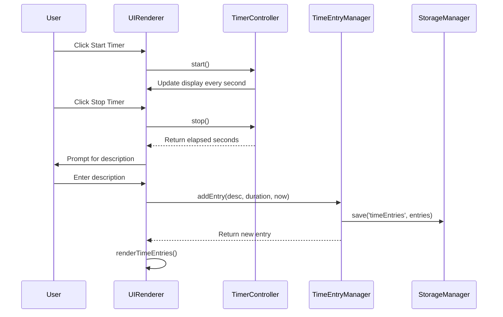

# Design Document: Timer Tracker

## Overview

The Timer Tracker is a client-side web application that combines time tracking and task management in a single interface. Built with vanilla JavaScript, HTML, and CSS, it provides users with two methods of time tracking: a real-time running timer and manual time entry. The application also includes a todo list with due date management and displays a daily summary of productivity metrics.

The architecture follows a modular approach with clear separation between data management, UI rendering, and business logic. All data persists in browser Local Storage, making the application fully functional offline without requiring a backend server.

### Key Design Goals

- **Simplicity**: Minimal dependencies using only vanilla JavaScript and standard web APIs
- **Responsiveness**: Immediate visual feedback for all user interactions
- **Reliability**: Automatic data persistence with every state change
- **Maintainability**: Clear separation of concerns between data, logic, and presentation layers

## Architecture

The application follows a layered architecture pattern:

```
┌─────────────────────────────────────────┐
│         User Interface Layer            │
│  (DOM manipulation, event handlers)     │
└─────────────────────────────────────────┘
                  ↓
┌─────────────────────────────────────────┐
│        Application Logic Layer          │
│  (Timer control, validation, summary)   │
└─────────────────────────────────────────┘
                  ↓
┌─────────────────────────────────────────┐
│         Data Management Layer           │
│  (CRUD operations, state management)    │
└─────────────────────────────────────────┘
                  ↓
┌─────────────────────────────────────────┐
│       Persistence Layer                 │
│  (Local Storage interface)              │
└─────────────────────────────────────────┘
```

### Layer Responsibilities

**User Interface Layer**
- Renders all visual components
- Handles user input events
- Updates display in response to state changes
- Provides visual feedback for user actions

**Application Logic Layer**
- Manages running timer state and updates
- Validates user input
- Calculates daily summaries
- Coordinates between UI and data layers

**Data Management Layer**
- Maintains in-memory state for time entries and todos
- Provides CRUD operations for both entity types
- Ensures data consistency
- Triggers persistence on state changes

**Persistence Layer**
- Abstracts Local Storage API
- Serializes/deserializes data structures
- Handles storage availability checks
- Manages error conditions

## Components and Interfaces

### Core Components

#### 1. StorageManager

Handles all interactions with browser Local Storage.

```javascript
class StorageManager {
  isAvailable(): boolean
  save(key: string, data: any): void
  load(key: string): any | null
  clear(key: string): void
}
```

**Responsibilities:**
- Check Local Storage availability
- Serialize data to JSON for storage
- Deserialize JSON data on retrieval
- Handle storage quota errors

#### 2. TimeEntryManager

Manages time entry data and operations.

```javascript
class TimeEntryManager {
  entries: TimeEntry[]
  
  addEntry(description: string, duration: number, timestamp: Date): TimeEntry
  updateEntry(id: string, updates: Partial<TimeEntry>): void
  deleteEntry(id: string): void
  getEntries(): TimeEntry[]
  getEntriesForDate(date: Date): TimeEntry[]
}
```

**Responsibilities:**
- Create, read, update, delete time entries
- Generate unique IDs for entries
- Filter entries by date
- Trigger persistence after mutations

#### 3. TodoManager

Manages todo item data and operations.

```javascript
class TodoManager {
  todos: TodoItem[]
  
  addTodo(description: string, dueDate?: Date): TodoItem
  updateTodo(id: string, updates: Partial<TodoItem>): void
  deleteTodo(id: string): void
  toggleComplete(id: string): void
  getTodos(): TodoItem[]
  getOverdueTodos(): TodoItem[]
}
```

**Responsibilities:**
- Create, read, update, delete todo items
- Toggle completion status
- Identify overdue items
- Trigger persistence after mutations

#### 4. TimerController

Controls the running timer functionality.

```javascript
class TimerController {
  isRunning: boolean
  startTime: Date | null
  elapsedSeconds: number
  
  start(): void
  stop(): number
  getElapsedTime(): number
  reset(): void
}
```

**Responsibilities:**
- Track timer start time
- Calculate elapsed duration
- Update elapsed time every second
- Provide current elapsed time for display

#### 5. SummaryCalculator

Calculates daily summary statistics.

```javascript
class SummaryCalculator {
  calculateDailyTotal(entries: TimeEntry[], date: Date): number
  countCompletedTodos(todos: TodoItem[], date: Date): number
  isToday(date: Date): boolean
}
```

**Responsibilities:**
- Sum time entries for a given date
- Count todos completed on a given date
- Determine if a date is today in local timezone

#### 6. UIRenderer

Renders all UI components and handles DOM updates.

```javascript
class UIRenderer {
  renderTimeEntries(entries: TimeEntry[]): void
  renderTodos(todos: TodoItem[]): void
  renderTimer(elapsedSeconds: number, isRunning: boolean): void
  renderSummary(totalTime: number, completedCount: number): void
  showError(message: string): void
  showFeedback(message: string): void
}
```

**Responsibilities:**
- Generate HTML for all components
- Update DOM efficiently
- Display error and success messages
- Provide visual feedback for actions

#### 7. InputValidator

Validates user input before processing.

```javascript
class InputValidator {
  validateTimeInput(hours: string, minutes: string): ValidationResult
  validateDescription(description: string): ValidationResult
  validateDate(dateString: string): ValidationResult
}
```

**Responsibilities:**
- Validate numeric inputs are non-negative
- Check for empty or invalid descriptions
- Validate date formats
- Return clear error messages

### Component Interactions



## Data Models

### TimeEntry

Represents a single time tracking record.

```javascript
{
  id: string,              // Unique identifier (UUID or timestamp-based)
  description: string,     // User-provided description of activity
  duration: number,        // Duration in seconds
  timestamp: string,       // ISO 8601 timestamp when entry was created
  createdAt: string       // ISO 8601 timestamp for record creation
}
```

**Constraints:**
- `id` must be unique across all time entries
- `description` must be non-empty string
- `duration` must be positive integer (seconds)
- `timestamp` and `createdAt` must be valid ISO 8601 strings

### TodoItem

Represents a single task in the todo list.

```javascript
{
  id: string,              // Unique identifier (UUID or timestamp-based)
  description: string,     // User-provided task description
  completed: boolean,      // Completion status
  completedAt: string | null,  // ISO 8601 timestamp when marked complete
  dueDate: string | null,  // ISO 8601 date string (YYYY-MM-DD)
  createdAt: string       // ISO 8601 timestamp for record creation
}
```

**Constraints:**
- `id` must be unique across all todo items
- `description` must be non-empty string
- `completed` defaults to false
- `completedAt` is null when not completed
- `dueDate` is optional, must be valid date string if present

### TimerState

Represents the current state of the running timer (in-memory only, not persisted).

```javascript
{
  isRunning: boolean,      // Whether timer is currently active
  startTime: number | null, // Unix timestamp (ms) when timer started
  elapsedSeconds: number   // Accumulated elapsed time in seconds
}
```

### Storage Schema

Data is stored in Local Storage using two keys:

**Key: `timerTracker_timeEntries`**
```javascript
{
  version: 1,
  entries: TimeEntry[]
}
```

**Key: `timerTracker_todos`**
```javascript
{
  version: 1,
  todos: TodoItem[]
}
```

The `version` field enables future schema migrations if needed.

